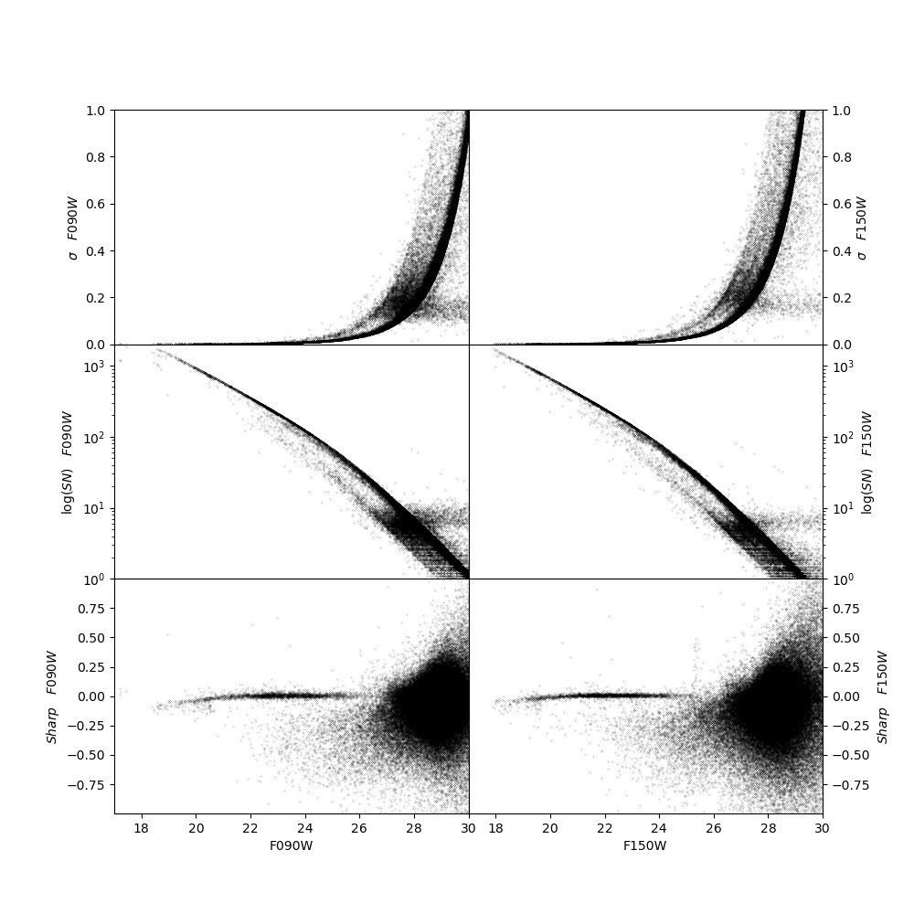
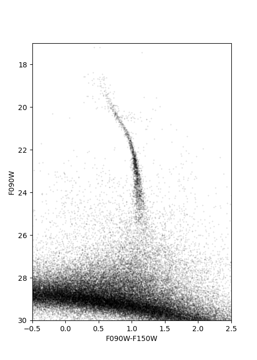
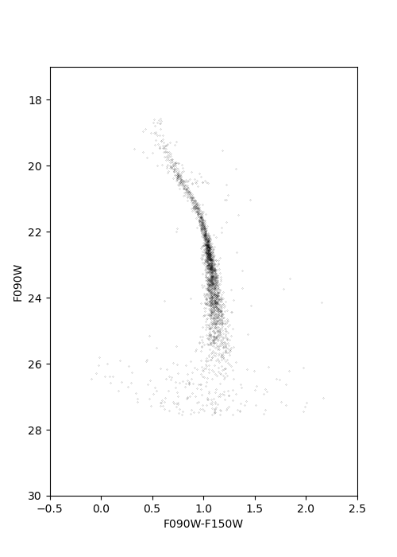
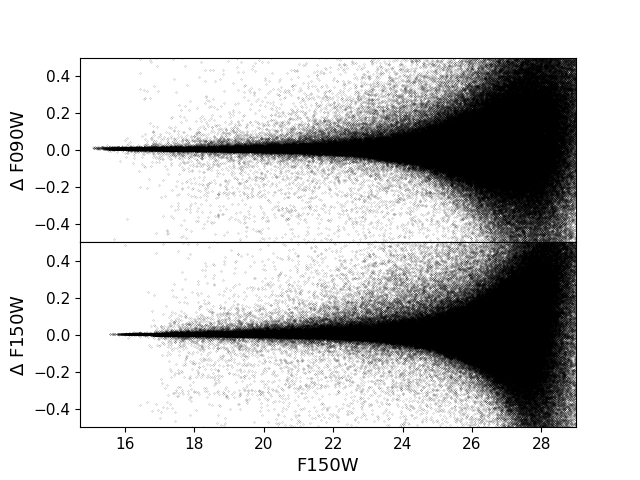
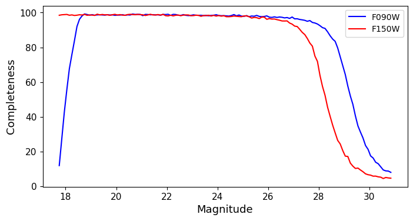
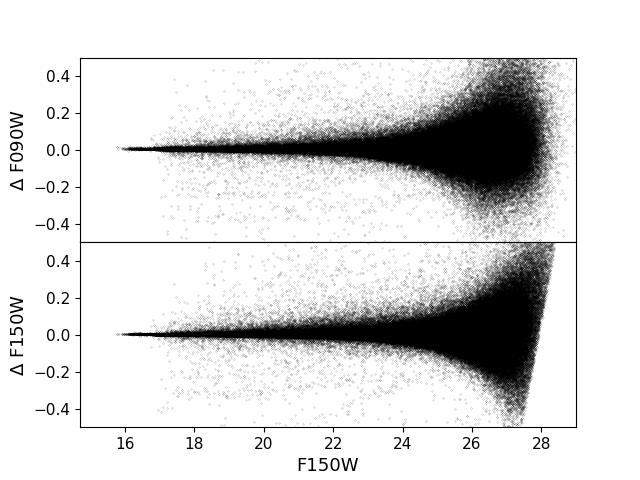
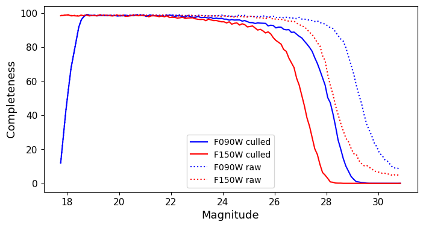

M92 NIRISS
======

Here we provide a working example of the reduction of M92 NIRISS data. The workflow is completely analogous to what presented in the main documentation, provided all the relevant NIRCam routines are replaced by the corresponding NIRISS routines.

PRE-PROCESSING
---------------

We start by setting up a directory in which we will perform the NIRISS reduction:

.. code-block:: bash
 
 > pwd
 > photometry/m92/niriss
 > ls
 > raw
 > ls raw/
 >jw01334-o001_t001_niriss_clear-f090w_i2d.fits
 >jw01334-o001_t001_niriss_clear-f150w_i2d.fits
 >jw01334001001_02201_00001_nis_cal.fits
 >jw01334001001_02201_00002_nis_cal.fits
 >jw01334001001_02201_00004_nis_cal.fits
 >jw01334001001_04201_00001_nis_cal.fits
 >jw01334001001_04201_00002_nis_cal.fits
 >jw01334001001_04201_00004_nis_cal.fits

We copy the image of interests in the main reduction directory:

.. code-block:: bash

  > pwd
  > photometry/m92/niriss/raw
  > cp *cal.fits ../
  > cp *i2d.fits ../
  > cd ../
  > ls *i2d.fits
  >jw01334-o001_t001_niriss_clear-f090w_i2d.fits
  >jw01334-o001_t001_niriss_clear-f150w_i2d.fits
  > ls *cal.fits
  >jw01334001001_02201_00001_nis_cal.fits
  >jw01334001001_02201_00002_nis_cal.fits
  >jw01334001001_02201_00004_nis_cal.fits
  >jw01334001001_04201_00001_nis_cal.fits
  >jw01334001001_04201_00002_nis_cal.fits
  >jw01334001001_04201_00004_nis_cal.fits
  

We run the images through the masking routine:

.. code-block:: bash

  > nirissmask -etctime jw01334-o001_t001_niriss_clear-f150w_i2d.fits
  > nirissmask -etctime jw01334001001_02201_00001_nis_cal.fits
  > nirissmask -etctime jw01334001001_02201_00002_nis_cal.fits
  > nirissmask -etctime jw01334001001_02201_00004_nis_cal.fits
  > nirissmask -etctime jw01334001001_04201_00001_nis_cal.fits
  > nirissmask -etctime jw01334001001_04201_00002_nis_cal.fits
  > nirissmask -etctime jw01334001001_04201_00004_nis_cal.fits

And calculate the sky maps:

.. code-block:: bash

  > calcsky jw01334-o001_t001_niriss_clear-f150w_i2d 10 25 -64 2.25 2.00
  > calcsky jw01334001001_02201_00001_nis_cal.fits 10 25 -64 2.25 2.00
  > calcsky jw01334001001_02201_00002_nis_cal.fits 10 25 -64 2.25 2.00
  > calcsky jw01334001001_02201_00004_nis_cal.fits 10 25 -64 2.25 2.00
  > calcsky jw01334001001_04201_00001_nis_cal.fits 10 25 -64 2.25 2.00
  > calcsky jw01334001001_04201_00002_nis_cal.fits 10 25 -64 2.25 2.00
  >j calcsky w01334001001_04201_00004_nis_cal.fits 10 25 -64 2.25 2.00

RUNNING DOLPHOT
-----------

Now that we have pre-processed the images, we can create the photometry parameter file, **phot.param**:

.. code-block:: bash

 Nimg = 6
 img0_file = jw01334-o001_t001_niriss_clear-f090w_i2d
 img1_file = jw01334001001_02201_00001_nis_cal
 img2_file = jw01334001001_02201_00002_nis_cal
 img3_file = jw01334001001_02201_00004_nis_cal
 img4_file = jw01334001001_04201_00001_nis_cal
 img5_file = jw01334001001_04201_00002_nis_cal
 img6_file = jw01334001001_04201_00004_nis_cal
 
 raper = 3
 rchi = 2.0
 rsky0 = 15
 rsky1 = 35
 rsky2 = 4 10
 rpsf = 15
 apsky = 20 35
 FitSky = 2
 SigPSF = 5.0
 FlagMask = 4
 SecondPass = 5
 PSFPhotIt = 2
 ApCor = 1
 FSat = 0.999
 NoiseMult = 0.1
 RCombine = 1.5
 CombineChi = 0
 MaxIT = 25
 InterpPSFlib = 1
 SigFindMult = 0.85
 PSFPhot = 1
 Force1 = 0
 SkySig = 2.25
 SkipSky = 1
 UseWCS = 2
 PSFres = 1
 PosStep = 0.25

.. note::

 Note that certain keywords (**raper**, **rchi** and **rsky2**) differ from the NIRCam case. Those keywords are camera specific, and should be used following the recommendations of `Weisz et al. 2023 <dummy>`_.

We are now ready to execute the PSF-photometry routine:

.. code-block:: bash

  > dolphot M92_NIRISS_example.phot -pphot.param > phot.log

POST-PROCESSING
---------

The reduction return the following information in the log:

.. code-block:: bash

 Reading IMAGE extension: 2048x2048
   GAIN=1.61 EXP=257s NOISE=11.88 BAD=-1910.22 SAT=511642.22
 Reading IMAGE extension: 2048x2048
   GAIN=1.61 EXP=257s NOISE=11.88 BAD=-1665.79 SAT=405452.50
 Reading IMAGE extension: 2048x2048
   GAIN=1.61 EXP=257s NOISE=11.88 BAD=-1748.47 SAT=452499.16
 Reading IMAGE extension: 2048x2048
   GAIN=1.61 EXP=257s NOISE=11.88 BAD=-2440.93 SAT=443917.62
 Reading IMAGE extension: 2051x2073
  GAIN=1.61 EXP=1202s NOISE=11.88 BAD=-4683.96 SAT=888584.38
 ...

 ...
 1054 stars for alignment
 image 1: 860 matched, 800 used, -0.07 -0.02 1.000000 0.00000 0.001, sig=0.15
 image 2: 871 matched, 798 used, -0.09 0.01 1.000000 0.00000 0.001, sig=0.14
 image 3: 908 matched, 823 used, -0.09 0.00 1.000000 0.00000 0.001, sig=0.14
 image 4: 931 matched, 863 used, -0.07 -0.06 1.000000 0.00000 0.001, sig=0.15
 image 5: 934 matched, 860 used, -0.08 -0.03 1.000000 0.00000 0.002, sig=0.15
 image 6: 937 matched, 849 used, -0.10 -0.03 1.000000 0.00000 0.001, sig=0.15
  ...

 ...
 258 PSF stars; 17223 neighbors
 Central pixel PSF adjustments:
 image 1: 209 stars, -0.045334
 image 2: 219 stars, -0.044607
 image 3: 216 stars, -0.044360
 image 4: 207 stars, -0.030079
 image 5: 213 stars, -0.029778
 image 6: 212 stars, -0.031652

 ...

 ...
 Aperture corrections:
 image 1: 200 total aperture stars
   200 stars used, -0.009 (-0.010 +/- 0.000, 0.001)
   193 stars used, -0.013 (-0.015 +/- 0.000, 0.001)
   200 stars used,  0.048 (0.048 +/- 0.000, 0.001)
 image 2: 200 total aperture stars
   200 stars used, -0.008 (-0.009 +/- 0.000, 0.001)
   196 stars used, -0.013 (-0.014 +/- 0.000, 0.001)
   200 stars used,  0.048 (0.048 +/- 0.000, 0.001)
 image 3: 200 total aperture stars
   200 stars used, -0.008 (-0.009 +/- 0.000, 0.001)
   195 stars used, -0.012 (-0.014 +/- 0.000, 0.001)
   200 stars used,  0.048 (0.048 +/- 0.000, 0.001)
 image 4: 200 total aperture stars
   200 stars used, -0.006 (-0.006 +/- 0.000, 0.001)
   195 stars used, -0.007 (-0.010 +/- 0.000, 0.001)
   200 stars used,  0.064 (0.064 +/- 0.000, 0.001)
 image 5: 200 total aperture stars
   200 stars used, -0.006 (-0.006 +/- 0.000, 0.001)
   196 stars used, -0.007 (-0.009 +/- 0.000, 0.001)
   200 stars used,  0.063 (0.064 +/- 0.000, 0.001)
 image 6: 200 total aperture stars
   200 stars used, -0.005 (-0.006 +/- 0.000, 0.001)
   197 stars used, -0.007 (-0.010 +/- 0.000, 0.001)
   200 stars used,  0.063 (0.064 +/- 0.000, 0.001)

.. Note::

We can inspect the output of the photometric catalog and note that the reduction has been successful:

  :width: 800
  :align: center

We can build a color-magnitude diagram from the raw catalog:

  :width: 400
  :align: center

Or apply stricter culling criteria (those of `Warfield et al. 2023 <https://ui.adsabs.harvard.edu/abs/2023RNAAS...7...23W/abstract>`_, in this example):

  :width: 400
  :align: center

ARTIFICIAL STAR TESTS
--------------------------

With the reduction process complete, we can now perform ASTs. We first create the input star list:

.. code-block:: bash

 > fakelist M92_NIRISS_example.phot NIRISS_F090W NIRISS_F150W 17 32 -0.5 2 -nstar=1000000 > NIRISS_fake.inputlist

to obtain a file, called **NIRISS_fake.inputlist**, with the following content:

.. code-block:: bash

 1 1  508.63  772.92 28.087 27.463
 1 1  764.48 1599.19 28.151 27.400
 1 1 1900.99  352.76 25.420 24.343
 1 1 1468.09   95.53 17.294 17.137
 1 1 1984.96 1745.81 30.240 29.935
 1 1 1652.47  941.67 28.648 27.971
 1 1  647.04  463.93 21.504 20.919
 1 1  122.71  449.34 22.915 22.747
 1 1 1096.84  626.13 20.064 18.274
 1 1  182.98  636.89 27.503 27.448
 1 1  397.27  255.57 27.949 26.320
 1 1 1119.31 1913.29 31.725 31.113
 ...

We then create a new parameter file, **NIRISS_fake.param**: 

.. code-block:: bash
  
 Nimg = 6
 img0_file = jw01334-o001_t001_niriss_clear-f090w_i2d
 img1_file = jw01334001001_02201_00001_nis_cal
 img2_file = jw01334001001_02201_00002_nis_cal
 img3_file = jw01334001001_02201_00004_nis_cal
 img4_file = jw01334001001_04201_00001_nis_cal
 img5_file = jw01334001001_04201_00002_nis_cal
 img6_file = jw01334001001_04201_00004_nis_cal
 
 raper = 3
 rchi = 2.0
 rsky0 = 15
 rsky1 = 35
 rsky2 = 4 10
 rpsf = 15
 apsky = 20 35
 FitSky = 2
 SigPSF = 5.0
 FlagMask = 4
 SecondPass = 5
 PSFPhotIt = 2
 ApCor = 1
 FSat = 0.999
 NoiseMult = 0.1
 RCombine = 1.5
 CombineChi = 0
 MaxIT = 25
 InterpPSFlib = 1
 SigFindMult = 0.85
 PSFPhot = 1
 Force1 = 0
 SkySig = 2.25
 SkipSky = 1
 UseWCS = 2
 PSFres = 1
 PosStep = 0.25

 FakeStars = NIRISS_fake.inputlist
 FakeOut = M92_NIRISS_example.fake
 RandomFake = 1
 FakeMatch = 3.0
 FakePad = 0
 FakeStarPSF = 0
 FakePSF = 1.5

We can now run *dolphot* in AST mode:

.. code-block:: bash
  
 > dolphot M92_NIRISS_example.phot -pNIRISS_fake.param > NIRISS_fake.log

Finally we can inspect the ASTs output:

  :width: 800
  :align: center

  :width: 800
  :align: center

And apply our desired culling criteria:

  :width: 800
  :align: center

  :width: 800
  :align: center

