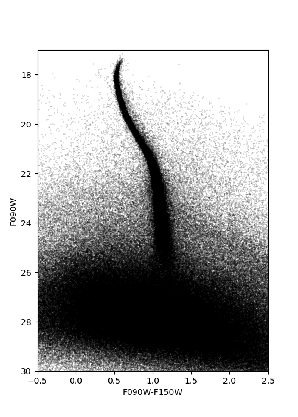
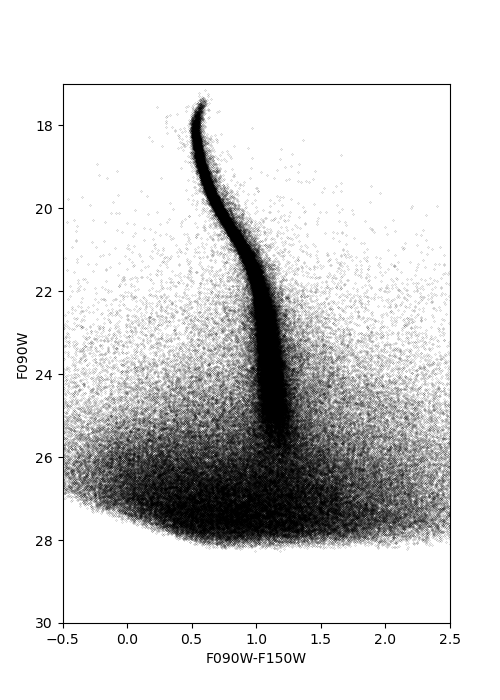
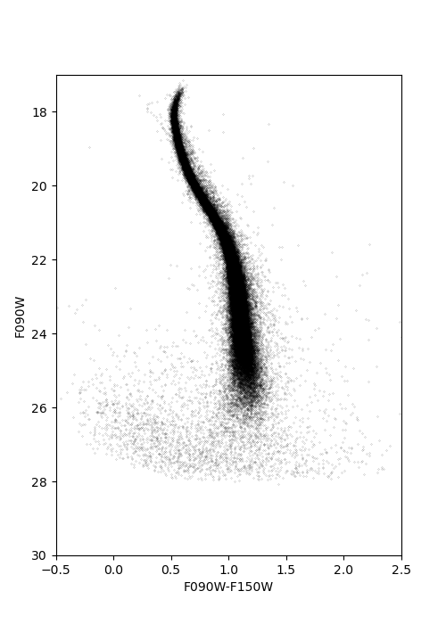

Culling the catalog
=============

We now have completed a successful DOLPHOT reduction and built our photometric catalog. However, practical applications require further post-processing to ensure we work with a meaningful source list. The catalog in **outputname**.phot, in fact, contains a fairly large number of contaminant sources, including background galaxies, artifacts, blends, poorly photometered stars, etc. This is obvious by inspecting the color-magnitude diagram.

In order to reduce these contaminants and obtain a catalog that contains mostly bona-fide stars, it is useful to inspect the quality parameters that DOLPHOT has calculated for each source. These parameters are listed both for the global photometry and for each individual filter, and include:

* **Type** (only given for global photometry): If **Force1** has been set to 0, this can be 1 (bright star, as set by **sigPSF**), 2 (faint star), 3 (elongated source), 4 (object too narrow), or 5 (extended source). If **Force1** has been set to 1, this parameter can only be 1 or 2. 
* **Chi**: The Chi-squared from the PSF-fit
* **SNR**: The signal-to-noise ratio of the source
* **Sharpness**: The angular extent of the source, compared to the PSF FWHM. A perfect point source would have a Sharpness of 0. A large negative Sharpness means that the source is extended (e.g., a background galaxy). A large positive Sharpness means that the source is narrower than the PSF (e.g., a hot pixel).
* **Roundness**: The ellipticity of the source's light-profile. A perfectly circular source has a Roundness value of 0.
* **Crowding**: The amount of contamination from neighboring sources. The value of Crowding is in magnitudes and represents how much brighter the star would have been measured had nearby stars not been fit simultaneously.
* **Quality Flag** (only given per filter): 0 if the source was fit without issues. A value of 1 is added if the photometry aperture extends off chip. A value of 2 is added is there are too many bad or saturated pixels. A value of 4 is added is the source is saturated at the center. A value of 8 is added for extreme cases of these problems. Multiple values can be added to flag.

Here we provide guidelines on how to use these metrics and standard recommendations, for the sake of homogeneity. However, experimentation and visual inspection of the color-magnitude diagram may be required, to tailor selection to your specific needs.

.. Tip::
  * **SNR** and **Sharpness** are, by far, the most useful metrics to select good stars. You may want to select stars with **SNR** above a threshold of 4 or 5.
  * Good **Sharpness** values should be as close to 0 as possible. This is usually done by selecting for **Sharp** ^2 to be below a certain threshold. Inspect the **Sharpness** vs Magnitude diagram to identify the appropriate cuts. You shoud be able to see high-SNR stars tightly clustered around 0, for a large range of magnitudes. 
  * **Round** and **Crodwing** can also help reject bad sources, for instance artifact stemming from diffraction spikes. Their efficacy, however, somewhat depends on the crowding properties of the field.
  * Selecting only sources with low **Flag** values (e.g., below 2-4) can help reject badly photometered stars. Depending on the **Force1** settings, **Type** can also be used to reject bad sources. If the field is very crowded, you may wish to ignore **Type** and do a more careful selection in **Sharpness**, **Crowding**, etc.
  * Due to details of the fit-procedure, we advise against using **Chi** to select good sources.

A loose, completenss-oriented, selection to reject obvious outliers but preserve as many stars as possible can be done using the following parameters:

* SNR >=4
* Sharp^2 <= 0.1
* Crowding <= 2.25
* Flag <= 2
* Type <= 2

Those criteria should be satisfied by all sufficiently deep filters. In our M92 example, we apply these cuts to both F090W and F150W, and obtain the following color-magnitude diagram.

As a rule of thumb, higher purity can be achieved by applying stricter cuts to **Sharpness** and **Crowding**. However, completeness, especially at low **SNR**, will also be decreased. For F090W and F150W, we have developed a strict, purity-oriented selection in `Warfield et al. (2023) <https://ui.adsabs.harvard.edu/abs/2023RNAAS...7...23W/abstract>`_:

* Sharp^2 <= 0.01
* Crowding <= 0.5
* Flag <= 2
* Type <= 2

To be satisfied in F090W and F150W simultaneously. This selection has been shown to be mostly pure down to **SNR** of 10. A higher level of residual contaminants might remain below that threshold. Applying these cuts to our M92 catalog (including a **SNR** <= 10 cut), we obtain the following color-magnitude diagram.

