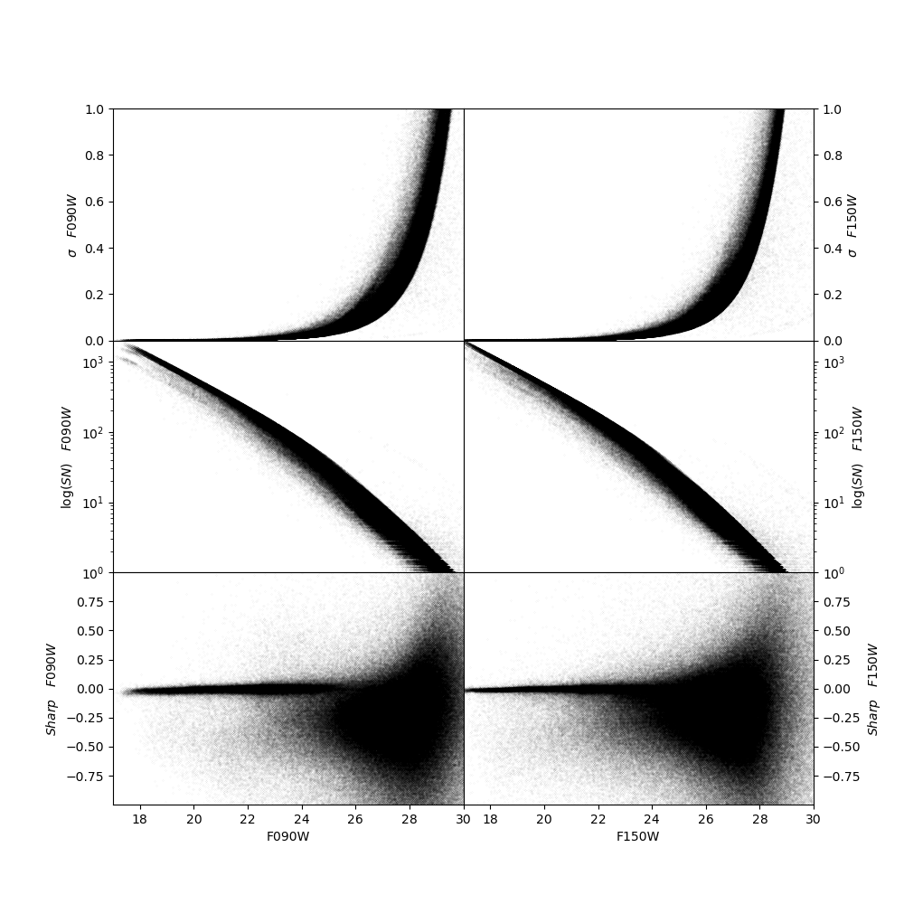

Examining the logs
============
When *dolphot* has finished running, we first verify the success of the run by examining several of the diagnostic files produced during the reduction, as well as inspection of the output photometric catalog.

The first file we may want to examine is the log file where we captured *dolphot*'s standard output. This log contains useful information about much of the reduction. The first step is to make sure the images were read in correctly and the CCD parameters were set to reasonable values. In the case of our M92 example, our log reports:

.. code-block:: bash

  Reading IMAGE extension: 2048x2048
    GAIN=2.08 EXP=268s NOISE=11.43 BAD=-628.85 SAT=293158.00
  Reading IMAGE extension: 2048x2048
    GAIN=2.02 EXP=268s NOISE=10.52 BAD=-284.37 SAT=366377.97
  Reading IMAGE extension: 2048x2048
    GAIN=2.17 EXP=268s NOISE=10.34 BAD=-508.59 SAT=276958.84
  Reading IMAGE extension: 2048x2048
    GAIN=2.02 EXP=268s NOISE=10.60 BAD=-162.74 SAT=276123.22
  Reading IMAGE extension: 2048x2048
    GAIN=2.01 EXP=268s NOISE=11.77 BAD=-1178.38 SAT=279833.47
  Reading IMAGE extension: 2048x2048
    GAIN=2.14 EXP=268s NOISE=12.77 BAD=-390.42 SAT=333020.91
  Reading IMAGE extension: 2048x2048
    GAIN=1.94 EXP=268s NOISE=11.85 BAD=-215.73 SAT=341808.75
  ...
  
If anything did not proceed correctly with the pre-processing routines (e.g., *nircammask*) it will usually be evident in the image parameters. Make sure that **GAIN**, **BAD** and **SAT** are *reasonable* values (i.e., close to unity, moderately negative numbers, and large positive numbers, respectively). 

After the images are read in correctly, a common source of poor photometry is the astrometric alignment of the frames. DOLPHOT calculates geometric transformations between each of the science frames and the reference image. If the transformations are not sufficiently accurate, the photometry will typically be suboptimal. In our M92 example, we can check the aligment in the log file:

.. code-block:: bash

  72112 stars for alignment
  image 1: 4073 matched, 3953 used, 0.08 0.03 1.000000 0.00000 -0.003, sig=0.08
  image 2: 4090 matched, 3999 used, 0.11 -0.06 1.000000 0.00000 0.004, sig=0.10
  image 3: 11001 matched, 10506 used, 0.02 0.05 1.000000 0.00000 0.001, sig=0.11
  image 4: 11557 matched, 10969 used, 0.04 -0.05 1.000000 0.00000 -0.003, sig=0.11
  image 5: 4759 matched, 4677 used, 0.06 0.04 1.000000 0.00000 -0.003, sig=0.12
  image 6: 4973 matched, 4861 used, 0.09 -0.02 1.000000 0.00000 0.003, sig=0.10

  ...
  
The two key metrics to monitor here are the number of matched stars for each image, and the **sig** values, which is the rms residual in *px* around the best-fit transformation. The acceptable values for matched stars and **sig** depend somewhat on how dense the stellar field is and what camera is being analyzed. For a moderately populated NIRCam field, we want most of the images to have at least 100 matched stars and **sig** values below 0.30. 

.. tip::
  If the alignment solutions are sub-optimal, you may first try to increase the AlignTol parameter.  Alternatively, you may try a different reference image.

Once we have made sure that the frames are properly aligned, we may wish to assess that the subsequent steps of the reduction have been successful. This includes making sure that enough PSF stars have been identified:

.. code-block:: bash

  4648 PSF stars; 735524 neighbors
  Central pixel PSF adjustments:
   image 1: 295 stars, -0.004390
   image 2: 272 stars, -0.002881
   image 3: 258 stars, -0.017773
   image 4: 267 stars, -0.006303
   image 5: 268 stars, -0.021525
   image 6: 206 stars, -0.024222
  ...
  
In a moderately populated NIRCam field, having at least 100 PSF stars per image would be desirable. Besides the number of PSF stars used for every image, *dolphot* also lists the average PSF adjustment. This is the fractional flux difference in the central PSF pixel, between the model PSFs and the profile of the PSF stars. Ideally, this number should be as close to 0 as possible. Absolute PSF adjustments below 0.05 should provide enough photometric accuracy for most applications.

Finally, the log file contains details about the aperture correction step. Again, make sure that at least 100 stars are used in each image:

.. code-block:: bash

  Aperture corrections:
  image 1: 200 total aperture stars
    200 stars used, -0.001 (-0.001 +/- 0.000, 0.001)
    199 stars used, -0.005 (-0.006 +/- 0.000, 0.001)
    200 stars used,  0.120 (0.119 +/- 0.000, 0.001)
  image 2: 200 total aperture stars
    200 stars used, -0.001 (-0.002 +/- 0.000, 0.001)
    198 stars used, -0.004 (-0.005 +/- 0.000, 0.001)
    200 stars used,  0.122 (0.122 +/- 0.000, 0.001)
  image 3: 200 total aperture stars
    200 stars used, -0.003 (-0.003 +/- 0.000, 0.001)
    198 stars used, -0.008 (-0.009 +/- 0.000, 0.001)
    200 stars used,  0.121 (0.120 +/- 0.000, 0.001)
  image 4: 200 total aperture stars
    200 stars used, -0.001 (-0.001 +/- 0.000, 0.001)
    198 stars used, -0.003 (-0.003 +/- 0.000, 0.001)
    200 stars used,  0.117 (0.117 +/- 0.000, 0.001)
  image 5: 200 total aperture stars
    200 stars used, -0.005 (-0.006 +/- 0.000, 0.001)
    197 stars used, -0.009 (-0.010 +/- 0.000, 0.001)
    200 stars used,  0.124 (0.124 +/- 0.000, 0.001)
  image 6: 200 total aperture stars
    200 stars used, -0.005 (-0.005 +/- 0.000, 0.001)
    199 stars used, -0.011 (-0.011 +/- 0.000, 0.001)
    200 stars used,  0.118 (0.118 +/- 0.000, 0.001)
  ...

If inspection of the log file does not reveal any anomaly, the reduction has most likely been successful. When *dolphot* is run with the following syntax:

.. code-block:: bash

  > dolphot <outputname> <options> > <logfile>

Additional diagnostic files are generated, using **outputname** as root. 

.. note::
The **outputname**.warnings contains potential anomalies that have been encountered during reduction and could have compromised photometric quality. Be sure to check this file. In our M92 example, M92_example.phot.warnings is empty.

Examining the catalog
============
  
The output photometric catalog is stored in the **outputname** file. This file contains a output line for each point-source identified during the reduction run. For each line, the **outputname** file contains a long list of outputs. These include photometric measurements and quality flags on each indivual frame, as well as combined photometry from multiple images that use the same filter. The detailed list of all output columns can be found in the **outputname**.columns file. In our example, these are the first 70 columns of our output file:

.. code-block:: bash

  1. Extension (zero for base image)
  2. Chip (for three-dimensional FITS image)
  3. Object X position on reference image (or first image, if no reference)
  4. Object Y position on reference image (or first image, if no reference)
  5. Chi for fit
  6. Signal-to-noise
  7. Object sharpness
  8. Object roundness
  9. Direction of major axis (if not round)
  10. Crowding
  11. Object type (1=bright star, 2=faint, 3=elongated, 4=hot pixel, 5=extended)
  12. Total counts, NIRCAM_F090W
  13. Total sky level, NIRCAM_F090W
  14. Normalized count rate, NIRCAM_F090W
  15. Normalized count rate uncertainty, NIRCAM_F090W
  16. Instrumental VEGAMAG magnitude, NIRCAM_F090W
  17. Transformed UBVRI magnitude, NIRCAM_F090W
  18. Magnitude uncertainty, NIRCAM_F090W
  19. Chi, NIRCAM_F090W
  20. Signal-to-noise, NIRCAM_F090W
  21. Sharpness, NIRCAM_F090W
  22. Roundness, NIRCAM_F090W
  23. Crowding, NIRCAM_F090W
  24. Photometry quality flag, NIRCAM_F090W
  25. Total counts, NIRCAM_F150W
  26. Total sky level, NIRCAM_F150W
  27. Normalized count rate, NIRCAM_F150W
  28. Normalized count rate uncertainty, NIRCAM_F150W
  29. Instrumental VEGAMAG magnitude, NIRCAM_F150W
  30. Transformed UBVRI magnitude, NIRCAM_F150W
  31. Magnitude uncertainty, NIRCAM_F150W
  32. Chi, NIRCAM_F150W
  33. Signal-to-noise, NIRCAM_F150W
  34. Sharpness, NIRCAM_F150W
  35. Roundness, NIRCAM_F150W
  36. Crowding, NIRCAM_F150W
  37. Photometry quality flag, NIRCAM_F150W
  38. Total counts, NIRCAM_F277W
  39. Total sky level, NIRCAM_F277W
  40. Normalized count rate, NIRCAM_F277W
  41. Normalized count rate uncertainty, NIRCAM_F277W
  42. Instrumental VEGAMAG magnitude, NIRCAM_F277W
  43. Transformed UBVRI magnitude, NIRCAM_F277W
  44. Magnitude uncertainty, NIRCAM_F277W
  45. Chi, NIRCAM_F277W
  46. Signal-to-noise, NIRCAM_F277W
  47. Sharpness, NIRCAM_F277W
  48. Roundness, NIRCAM_F277W
  49. Crowding, NIRCAM_F277W
  50. Photometry quality flag, NIRCAM_F277W
  51. Total counts, NIRCAM_F444W
  52. Total sky level, NIRCAM_F444W
  53. Normalized count rate, NIRCAM_F444W
  54. Normalized count rate uncertainty, NIRCAM_F444W
  55. Instrumental VEGAMAG magnitude, NIRCAM_F444W
  56. Transformed UBVRI magnitude, NIRCAM_F444W
  57. Magnitude uncertainty, NIRCAM_F444W
  58. Chi, NIRCAM_F444W
  59. Signal-to-noise, NIRCAM_F444W
  60. Sharpness, NIRCAM_F444W
  61. Roundness, NIRCAM_F444W
  62. Crowding, NIRCAM_F444W
  63. Photometry quality flag, NIRCAM_F444W
  64. Measured counts, jw01334001001_02101_00001_nrca1_cal (NIRCAM_F090W, 268.4 sec)
  65. Measured sky level, jw01334001001_02101_00001_nrca1_cal (NIRCAM_F090W, 268.4 sec)
  66. Normalized count rate, jw01334001001_02101_00001_nrca1_cal (NIRCAM_F090W, 268.4 sec)
  67. Normalized count rate uncertainty, jw01334001001_02101_00001_nrca1_cal (NIRCAM_F090W, 268.4 sec)
  68. Instrumental VEGAMAG magnitude, jw01334001001_02101_00001_nrca1_cal (NIRCAM_F090W, 268.4 sec)
  69. Transformed UBVRI magnitude, jw01334001001_02101_00001_nrca1_cal (NIRCAM_F090W, 268.4 sec)
  70. Magnitude uncertainty, jw01334001001_02101_00001_nrca1_cal (NIRCAM_F090W, 268.4 sec)
  ...

While the frame-by-frame photometric output (columns 64 and below, in our example) can be useful for, e.g. variable star work, for the purpose of generating a photometric catlog, we are only interested in the global properties of the source (columns 3-11) and in the combined photometry properties (columns 12-63). For example, we can use these quantities to perform a first inspection of the photometry. In our example, we can see in the plot below that the photometric error and the signal-to-noise follow expected and well-defined trends as function of source magnitude. The sharpness values (see `Culling the catalog <../catalogs.srt>`_ for more details) are also close to 0 for a large range of magnitudes, demonstrating the good outcome of the PSF-photometry. 

