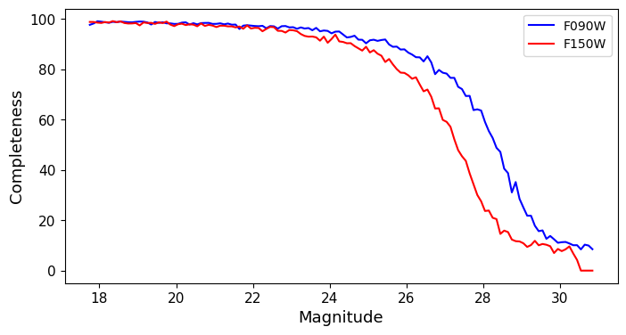

Working with Artifical Star Tests
==========

Now that we have an AST output file, we can use it to evaluate the photometric performance of our run. If working with *Nimage* frames, the first (4+2 *Nimage*) columns out the AST output file will be:

.. code-block:: bash

  1 1 X Y C1 M1 C2 M2 C3 M3.....

Where X and Y are the input position on the reference image coordinate system, and Cn and Mn are the counts and magnitude of the mock star in the nth frame. After these initial columns, the output file has exactly the same structure of the original photometry file. The file will contain one entry per artificial star. Stars which are not detected in the output photometry will have magnitude measurements of 99.999.

From this file, we can use the measured properties of the input ASTs to characterize the performance of our photometric reduction. For instance, the difference between the input and output magnitude, is a good tracer of the real photometric uncertainty which, especially at low SNR, can differ substantially from the nominal photometric error provided by *dolphot*:

.. figure:: ../images/M92_Doc_rawAST.png
  :width: 800
  :align: center

Alternatively, we can use the number of ASTs recovered, as a function of magnitude, to estimate the selection function of our photometry:

It is important to remeber that the ASTs needs to be postprocessed **exactly** in the same way as the primary photometric catalog. This includes spatial cuts, color cuts and culling through the photometric quality metrics. In our M92 example, we can apply the 
