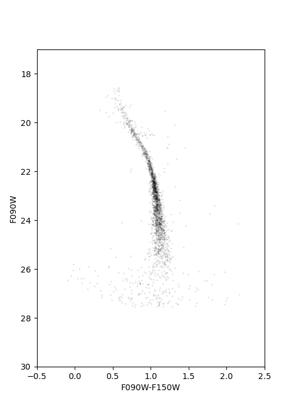
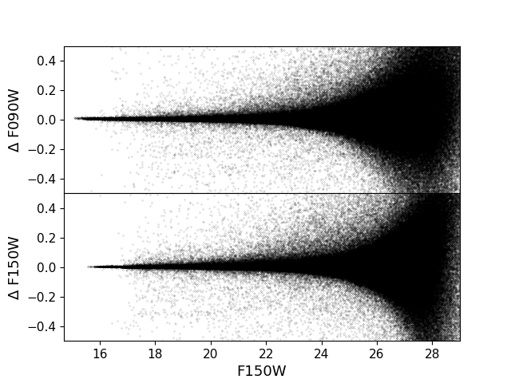
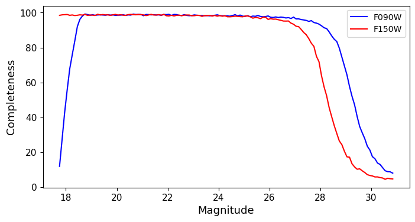

M92 NIRISS
======

Here we provide a working example of the reduction of M92 NIRISS data. The workflow is completely analogous to what presented in the main documentation, provided all the relevant NIRCam routines are replaced by the corresponding NIRISS routines.

PRE-PROCESSING
---------------

We start by setting up a directory in which we will perform the NIRISS reduction:

.. code-block:: bash
 
 > pwd
 > photometry/m92/niriss
 > ls
 > raw
 > ls raw/
 >jw01334-o001_t001_niriss_clear-f090w_i2d.fits
 >jw01334-o001_t001_niriss_clear-f150w_i2d.fits
 >jw01334001001_02201_00001_nis_cal.fits
 >jw01334001001_02201_00002_nis_cal.fits
 >jw01334001001_02201_00004_nis_cal.fits
 >jw01334001001_04201_00001_nis_cal.fits
 >jw01334001001_04201_00002_nis_cal.fits
 >jw01334001001_04201_00004_nis_cal.fits

We copy the image of interests in the main reduction directory:

.. code-block:: bash

  > pwd
  > photometry/m92/niriss/raw
  > cp *cal.fits ../
  > cp *i2d.fits ../
  > cd ../
  > ls *i2d.fits
  >jw01334-o001_t001_niriss_clear-f090w_i2d.fits
  >jw01334-o001_t001_niriss_clear-f150w_i2d.fits
  > ls *cal.fits
  >jw01334001001_02201_00001_nis_cal.fits
  >jw01334001001_02201_00002_nis_cal.fits
  >jw01334001001_02201_00004_nis_cal.fits
  >jw01334001001_04201_00001_nis_cal.fits
  >jw01334001001_04201_00002_nis_cal.fits
  >jw01334001001_04201_00004_nis_cal.fits
  

We run the images through the masking routine:

.. code-block:: bash

  > nirissmask jw01334-o001_t001_niriss_clear-f150w_i2d.fits
  > nirissmask jw01334001001_02201_00001_nis_cal.fits
  > nirissmask jw01334001001_02201_00002_nis_cal.fits
  > nirissmask jw01334001001_02201_00004_nis_cal.fits
  > nirissmask jw01334001001_04201_00001_nis_cal.fits
  > nirissmask jw01334001001_04201_00002_nis_cal.fits
  > nirissmask jw01334001001_04201_00004_nis_cal.fits

And calculate the sky maps:

.. code-block:: bash

  > calcsky jw01334-o001_t001_niriss_clear-f150w_i2d 10 25 -64 2.25 2.00
  > calcsky jw01334001001_02201_00001_nis_cal.fits 10 25 -64 2.25 2.00
  > calcsky jw01334001001_02201_00002_nis_cal.fits 10 25 -64 2.25 2.00
  > calcsky jw01334001001_02201_00004_nis_cal.fits 10 25 -64 2.25 2.00
  > calcsky jw01334001001_04201_00001_nis_cal.fits 10 25 -64 2.25 2.00
  > calcsky jw01334001001_04201_00002_nis_cal.fits 10 25 -64 2.25 2.00
  >j calcsky w01334001001_04201_00004_nis_cal.fits 10 25 -64 2.25 2.00

RUNNING DOLPHOT
-----------

Now that we have pre-processed the images, we can create the photometry parameter file, **phot.param**:

.. code-block:: bash

 Nimg = 6
 img0_file = jw01334-o001_t001_niriss_clear-f090w_i2d
 img1_file = jw01334001001_02201_00001_nis_cal
 img2_file = jw01334001001_02201_00002_nis_cal
 img3_file = jw01334001001_02201_00004_nis_cal
 img4_file = jw01334001001_04201_00001_nis_cal
 img5_file = jw01334001001_04201_00002_nis_cal
 img6_file = jw01334001001_04201_00004_nis_cal
 
 raper = 3
 rchi = 2.0
 rsky0 = 15
 rsky1 = 35
 rsky2 = 4 10
 rpsf = 15
 apsky = 20 35
 FitSky = 2
 SigPSF = 5.0
 FlagMask = 4
 SecondPass = 5
 PSFPhotIt = 2
 ApCor = 1
 FSat = 0.999
 NoiseMult = 0.1
 RCombine = 1.5
 CombineChi = 0
 MaxIT = 25
 InterpPSFlib = 1
 SigFindMult = 0.85
 PSFPhot = 1
 Force1 = 0
 SkySig = 2.25
 SkipSky = 1
 UseWCS = 2
 PSFres = 1
 PosStep = 0.25

.. note::

 Note that certain keywords (**raper**, **rchi** and **rsky2**) differ from the NIRCam case. Those keywords are camera specific, and should be used following the recommendations of `Weisz et al. 2023 <dummy>`_.

We are now ready to execute the PSF-photometry routine:

.. code-block:: bash

  > dolphot M92_NIRISS_example.phot -pphot.param > phot.log

POST-PROCESSING
---------

The reduction return the following information in the log:

.. code-block:: bash

 Reading IMAGE extension: 2048x2048
   GAIN=1.61 EXP=300s NOISE=11.88 BAD=-2298.80 SAT=596916.94
 Reading IMAGE extension: 2048x2048
   GAIN=1.61 EXP=300s NOISE=11.88 BAD=-2013.63 SAT=473028.62
 Reading IMAGE extension: 2048x2048
   GAIN=1.61 EXP=300s NOISE=11.88 BAD=-2074.27 SAT=532400.44
 Reading IMAGE extension: 2048x2048
   GAIN=1.61 EXP=300s NOISE=11.88 BAD=-2882.79 SAT=517904.66
 Reading IMAGE extension: 2051x2073
  GAIN=1.61 EXP=1202s NOISE=11.88 BAD=-4959.61 SAT=863273.44
 ...

 ...
 89 stars for alignment
 image 1: 16 matched, 16 used, -0.24 0.02 1.000000 0.00000 0.014, sig=0.55
 image 2: 16 matched, 16 used, -0.06 -0.02 1.000000 0.00000 -0.010, sig=0.43
 image 3: 26 matched, 25 used, 0.19 0.04 1.000000 0.00000 -0.000, sig=0.42
 image 4: 11 matched, 9 used, 0.08 -0.21 1.000000 0.00000 -0.007, sig=0.26
 image 5: 10 matched, 10 used, -0.01 -0.06 1.000000 0.00000 -0.005, sig=0.83
 image 6: 21 matched, 17 used, 0.10 0.07 1.000000 0.00000 0.000, sig=0.32
  ...

 ...
 278 PSF stars; 17691 neighbors
 Central pixel PSF adjustments:
 image 1: 242 stars, -0.157776
 image 2: 237 stars, -0.127200
 image 3: 233 stars, -0.159651
 image 4: 239 stars, -0.095544
 image 5: 236 stars, -0.115109
 image 6: 233 stars, -0.130515

 ...

 ...
 Aperture corrections:
 image 1: 102 total aperture stars
   98 stars used, -0.044 (-0.046 +/- 0.000, 0.004)
   94 stars used, -0.033 (-0.027 +/- 0.001, 0.008)
   102 stars used,  0.045 (0.045 +/- 0.000, 0.001)
 image 2: 99 total aperture stars
   95 stars used, -0.038 (-0.039 +/- 0.000, 0.004)
   92 stars used, -0.027 (-0.031 +/- 0.001, 0.008)
   99 stars used,  0.045 (0.045 +/- 0.000, 0.001)
 image 3: 82 total aperture stars
   80 stars used, -0.041 (-0.042 +/- 0.000, 0.004)
   79 stars used, -0.011 (-0.011 +/- 0.001, 0.009)
   82 stars used,  0.045 (0.045 +/- 0.000, 0.001)
 image 4: 115 total aperture stars
   114 stars used, -0.030 (-0.034 +/- 0.000, 0.003)
   108 stars used, -0.000 (0.001 +/- 0.000, 0.006)
   115 stars used,  0.061 (0.061 +/- 0.000, 0.001)
 image 5: 108 total aperture stars
   106 stars used, -0.028 (-0.028 +/- 0.000, 0.003)
   103 stars used,  0.002 (-0.002 +/- 0.000, 0.006)
   108 stars used,  0.061 (0.061 +/- 0.000, 0.001)
 image 6: 104 total aperture stars
   101 stars used, -0.034 (-0.036 +/- 0.000, 0.003)
   96 stars used, -0.011 (-0.011 +/- 0.001, 0.006)
   104 stars used,  0.060 (0.061 +/- 0.000, 0.001)

.. Note::

 Note that the reduction process has encountered more difficulties than in the NIRCam case. The alignment step has used very few stars and has large residuals. This is due to the NIRISS frame capturing a very sparse stellar field ( XX arcmin away from M92 center). The central PSF adjustment are also larger than for the NIRCam reduction. This is due to current limitations of the NIRISS PSF models.

We can inspect the output of the photometric catalog and note that the reduction has been successful, although the quality of the photometry is not as good as for NIRCam, for the reasons discussed above:

.. figure:: ../images/M92_Doc_NIRISSQuality.png

  :width: 800
  :align: center

We can build a color-magnitude diagram from the raw catalog:

.. figure:: ../images/M92_Doc_NIRISSraw.png

  :width: 400
  :align: center

Or apply stricter culling criteria (those of `Warfield et al. 2023 <https://ui.adsabs.harvard.edu/abs/2023RNAAS...7...23W/abstract>`_, in this example):

  :width: 400
  :align: center

ARTIFICIAL STAR TESTS
--------------------------

With the reduction process complete, we can now perform ASTs. We first create the input star list:

.. code-block:: bash

 > fakelist M92_NIRISS_example.phot NIRISS_F090W NIRISS_F150W 17 31 -0.5 2 -nstar=500000 > NIRISS_fake.inputlist

We then create a new parameter file, **NIRISS_fake.param**: 

.. code-block:: bash
  
 Nimg = 6
 img0_file = jw01334-o001_t001_niriss_clear-f090w_i2d
 img1_file = jw01334001001_02201_00001_nis_cal
 img2_file = jw01334001001_02201_00002_nis_cal
 img3_file = jw01334001001_02201_00004_nis_cal
 img4_file = jw01334001001_04201_00001_nis_cal
 img5_file = jw01334001001_04201_00002_nis_cal
 img6_file = jw01334001001_04201_00004_nis_cal
 
 raper = 3
 rchi = 2.0
 rsky0 = 15
 rsky1 = 35
 rsky2 = 4 10
 rpsf = 15
 apsky = 20 35
 FitSky = 2
 SigPSF = 5.0
 FlagMask = 4
 SecondPass = 5
 PSFPhotIt = 2
 ApCor = 1
 FSat = 0.999
 NoiseMult = 0.1
 RCombine = 1.5
 CombineChi = 0
 MaxIT = 25
 InterpPSFlib = 1
 SigFindMult = 0.85
 PSFPhot = 1
 Force1 = 0
 SkySig = 2.25
 SkipSky = 1
 UseWCS = 2
 PSFres = 1
 PosStep = 0.25

 FakeStars = NIRISS_fake.inputlist
 FakeOut = M92_NIRISS_example.fake
 RandomFake = 1
 FakeMatch = 3.0
 FakePad = 0
 FakeStarPSF = 0
 FakePSF = 1.5

We can now run *dolphot* in AST mode:

.. code-block:: bash
  
 > dolphot M92_NIRISS_example.phot -pNIRISS_fake.param > NIRISS_fake.log

Finally we can inspect the ASTs output:

  :width: 800
  :align: center

  :width: 800
  :align: center

And apply our desired culling criteria:

.. figure:: ../images/M92_Doc_NIRISScutAST.png

  :width: 800
  :align: center

.. figure:: ../images/M92_Doc_NIRISScutComplete.png

  :width: 800
  :align: center

