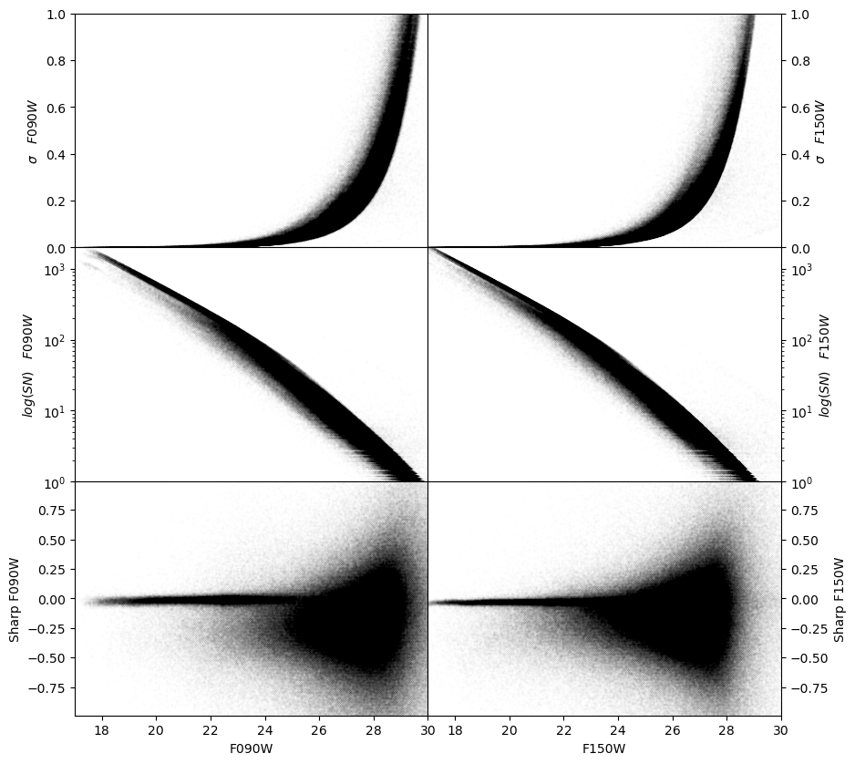

Examining the logs
============
When *dolphot* has completed running, we need to make sure the reduction run is successful and the photometry reliable. This is done through inspection of the many diagnostic files produced during reduction, as well as inspection of the output photometric catalog.

The first file we may want to examine is the log file where we captured *dolphot*'s standard output. This log contains useful information on about the many steps of the reduction. The first step is to make sure the images were read in correctly and the CCD parameters were set to reasonable values. In the case of our M92 example, our log reports:

.. code-block:: bash

  Reading IMAGE extension: 2048x2048
    GAIN=2.08 EXP=311s NOISE=11.43 BAD=-740.28 SAT=335568.78
  Reading IMAGE extension: 2048x2048
    GAIN=2.02 EXP=311s NOISE=10.52 BAD=-334.05 SAT=423324.06
  Reading IMAGE extension: 2048x2048
    GAIN=2.17 EXP=311s NOISE=10.34 BAD=-604.93 SAT=321757.56
  Reading IMAGE extension: 2048x2048
    GAIN=2.02 EXP=311s NOISE=10.60 BAD=-203.43 SAT=321226.41
  Reading IMAGE extension: 2048x2048
    GAIN=2.01 EXP=311s NOISE=11.77 BAD=-1369.48 SAT=327728.19
  Reading IMAGE extension: 2048x2048
    GAIN=2.14 EXP=311s NOISE=12.77 BAD=-451.42 SAT=387245.75
  Reading IMAGE extension: 2048x2048
   GAIN=1.94 EXP=311s NOISE=11.85 BAD=-253.31 SAT=397041.56
  ...
  
If anything did not proceed correctly with the pre-processing routines (e.g., *nircammask*) it will usually manifest in the image parameters. Make sure that **GAIN**, **BAD** and **SAT** are *reasonable* values (i.e., low unity, moderatley negative numbers, and large positive numbers, respectively). 

After the images are read in correctely, a common source of problems involves the astrometric alignment of the frames. DOLPHOT calculates geometric transformations between each of the science frames and the reference image. If the transformations are not sufficiently accurate, the photometry will typically be suboptimal. In our M92 example, we can check the aligment in the log file:

.. code-block:: bash

  48010 stars for alignment
  image 1: 2164 matched, 2119 used, 0.13 -0.04 1.000000 0.00000 -0.002, sig=0.10
  image 2: 2404 matched, 2347 used, 0.15 -0.14 1.000000 0.00000 0.004, sig=0.12
  image 3: 6059 matched, 5844 used, 0.07 -0.03 1.000000 0.00000 0.000, sig=0.13
  image 4: 6924 matched, 6609 used, 0.08 -0.13 1.000000 0.00000 -0.003, sig=0.12
  image 5: 2557 matched, 2514 used, 0.10 -0.03 1.000000 0.00000 -0.003, sig=0.13
  image 6: 2284 matched, 2234 used, 0.11 -0.10 1.000000 0.00000 0.003, sig=0.11

  ...
  
The two key metrics to monitor here are the number of matched stars for each image, and the **sig** values, which is the rms residual in *px* around the best-fit transformation. The acceptable values for matched stars and **sig** depend somewhat on how dense the stellar field is and what camera is being analyzed. For a moderately populated NIRCam field, we want most of the images to have at least 100 matched stars and **sig** values below 0.30. 

.. tip::
  If the alignment solutions are sub-optimal, you may try using a different frame as reference image. This is sometimes sufficient to solve the issue.

Once we have made sure that the frames are properly aligned, we may wish to assess that the subsequent steps of the reduction have been successful. This includes making sure that enough PSF stars have been identified:

.. code-block:: bash

  4267 PSF stars; 388810 neighbors
  Central pixel PSF adjustments:
  image 1: 281 stars, -0.008473
  image 2: 242 stars, -0.009880
  image 3: 287 stars, -0.021538
  image 4: 236 stars, -0.015164
  image 5: 272 stars, -0.030575
  image 6: 212 stars, -0.032961
  ...
  
In a moderately populated NIRCam field, having at least 100 PSF stars per image would be desirable. Besides the number of PSF stars used for every image, *dolphot* also lists the average PSF adjustment. This is the fractional flux difference in the central PSF pixel, between the model PSFs and the profile of the PSF stars. Ideally, this number should be as close to 0 as possible. Absolute PSF adjustments below 0.05 should provide enough photometric accuracy for most applications.

.. note::
  Due to current model limitations, NIRCam PSF models are known to be too concentrated compared to actual data (i.e. negative PSF adjustments). For filters in the short wavelength channel, this effect is between 2% and 4% of the central pixel flux. Filters in the long wavelength channel can be affected more severely.

Finally, the log file contains details about the aperture correction step. Again, make sure that at least 100 stars are used in each image:

.. code-block:: bash

  Aperture corrections:
  image 1: 200 total aperture stars
    200 stars used, -0.003 (-0.003 +/- 0.000, 0.001)
    200 stars used,  0.001 (0.001 +/- 0.000, 0.001)
    200 stars used,  0.128 (0.128 +/- 0.000, 0.001)
  image 2: 200 total aperture stars
    200 stars used, -0.003 (-0.003 +/- 0.000, 0.001)
    199 stars used,  0.001 (0.001 +/- 0.000, 0.001)
    200 stars used,  0.096 (0.097 +/- 0.000, 0.001)
  image 3: 200 total aperture stars
    200 stars used, -0.005 (-0.005 +/- 0.000, 0.001)
    199 stars used,  0.000 (0.000 +/- 0.000, 0.001)
    200 stars used,  0.137 (0.137 +/- 0.000, 0.001)
  image 4: 200 total aperture stars
    200 stars used, -0.003 (-0.004 +/- 0.000, 0.001)
    200 stars used,  0.005 (0.005 +/- 0.000, 0.001)
    200 stars used,  0.102 (0.102 +/- 0.000, 0.001)
  image 5: 200 total aperture stars
    200 stars used, -0.006 (-0.006 +/- 0.000, 0.001)
    199 stars used, -0.005 (-0.006 +/- 0.000, 0.001)
    200 stars used,  0.095 (0.095 +/- 0.000, 0.001)
  image 6: 200 total aperture stars
    200 stars used, -0.007 (-0.007 +/- 0.000, 0.001)
    199 stars used, -0.008 (-0.008 +/- 0.000, 0.001)
    200 stars used,  0.124 (0.124 +/- 0.000, 0.001)
  ...

If inspection of the log file does not reveal any anomaly, the reduction has most likely been successful. When *dolphot* is run with the following syntax:

.. code-block:: bash

  > dolphot <outputname> <options> > <logfile>

Additional diagnostic files are generated, using **outputname** as root. In particular, **outputname**.warnings contains potential anomalies that have been encountered during reduction and could have compromised photometric quality. Be sure to inspect the content of this file. In our M92 example, M92_example.phot.warnings is empty.

Examining the catalog
============
  
The output photometric catalog is stored in the **outputname** file. This file contains a output line for each point-source identified during the reduction run. For each line, the **outputname** file contains a long list of outputs. These include photometric measurements and quality flags on each indivual frame, as well as combined photometry from multiple images that use the same filter. The detailed list of all output columns can be found in the **outputname**.columns file. In our example, these are the first 50 columns of our output file:

.. code-block:: bash

  1. Extension (zero for base image)
  2. Chip (for three-dimensional FITS image)
  3. Object X position on reference image (or first image, if no reference)
  4. Object Y position on reference image (or first image, if no reference)
  5. Chi for fit
  6. Signal-to-noise
  7. Object sharpness
  8. Object roundness
  9. Direction of major axis (if not round)
  10. Crowding
  11. Object type (1=bright star, 2=faint, 3=elongated, 4=hot pixel, 5=extended)
  12. Total counts, NIRCAM_F090W
  13. Total sky level, NIRCAM_F090W
  14. Normalized count rate, NIRCAM_F090W
  15. Normalized count rate uncertainty, NIRCAM_F090W
  16. Instrumental VEGAMAG magnitude, NIRCAM_F090W
  17. Transformed UBVRI magnitude, NIRCAM_F090W
  18. Magnitude uncertainty, NIRCAM_F090W
  19. Chi, NIRCAM_F090W
  20. Signal-to-noise, NIRCAM_F090W
  21. Sharpness, NIRCAM_F090W
  22. Roundness, NIRCAM_F090W
  23. Crowding, NIRCAM_F090W
  24. Photometry quality flag, NIRCAM_F090W
  25. Total counts, NIRCAM_F150W
  26. Total sky level, NIRCAM_F150W
  27. Normalized count rate, NIRCAM_F150W
  28. Normalized count rate uncertainty, NIRCAM_F150W
  29. Instrumental VEGAMAG magnitude, NIRCAM_F150W
  30. Transformed UBVRI magnitude, NIRCAM_F150W
  31. Magnitude uncertainty, NIRCAM_F150W
  32. Chi, NIRCAM_F150W
  33. Signal-to-noise, NIRCAM_F150W
  34. Sharpness, NIRCAM_F150W
  35. Roundness, NIRCAM_F150W
  36. Crowding, NIRCAM_F150W
  37. Photometry quality flag, NIRCAM_F150W
  38. Measured counts, jw01334001001_02101_00001_nrca1_cal (NIRCAM_F090W, 311.4 sec)
  39. Measured sky level, jw01334001001_02101_00001_nrca1_cal (NIRCAM_F090W, 311.4 sec)
  40. Normalized count rate, jw01334001001_02101_00001_nrca1_cal (NIRCAM_F090W, 311.4 sec)
  41. Normalized count rate uncertainty, jw01334001001_02101_00001_nrca1_cal (NIRCAM_F090W, 311.4 sec)
  42. Instrumental VEGAMAG magnitude, jw01334001001_02101_00001_nrca1_cal (NIRCAM_F090W, 311.4 sec)
  43. Transformed UBVRI magnitude, jw01334001001_02101_00001_nrca1_cal (NIRCAM_F090W, 311.4 sec)
  44. Magnitude uncertainty, jw01334001001_02101_00001_nrca1_cal (NIRCAM_F090W, 311.4 sec)
  45. Chi, jw01334001001_02101_00001_nrca1_cal (NIRCAM_F090W, 311.4 sec)
  46. Signal-to-noise, jw01334001001_02101_00001_nrca1_cal (NIRCAM_F090W, 311.4 sec)
  47. Sharpness, jw01334001001_02101_00001_nrca1_cal (NIRCAM_F090W, 311.4 sec)
  48. Roundness, jw01334001001_02101_00001_nrca1_cal (NIRCAM_F090W, 311.4 sec)
  49. Crowding, jw01334001001_02101_00001_nrca1_cal (NIRCAM_F090W, 311.4 sec)
  50. Photometry quality flag, jw01334001001_02101_00001_nrca1_cal (NIRCAM_F090W, 311.4 sec)
  ...

While the frame-by-frame photometric output (columns 38 and below, in our example) can be useful for, e.g. variable star work, for the purpose of generating a photometric catlog, we are only interested in the global properties of the source (columns 3-11) and in the combined photometry properties (columns 12-37). We can use these quantity for instance, to perform a first inspection of the photometry and confirm that the reduction has produced good quality output. In our example, we can see in the plot below that the photometric error and the signal-to-noise follow expected and well-defined trends as function of source magnitude. The sharpness values (see `Culling the catalog <../catalogs.srt>`_ for more details) are also close to 0 for a large range of magnitudes, demonstrating the good outcome of the PSF-photometry. 

